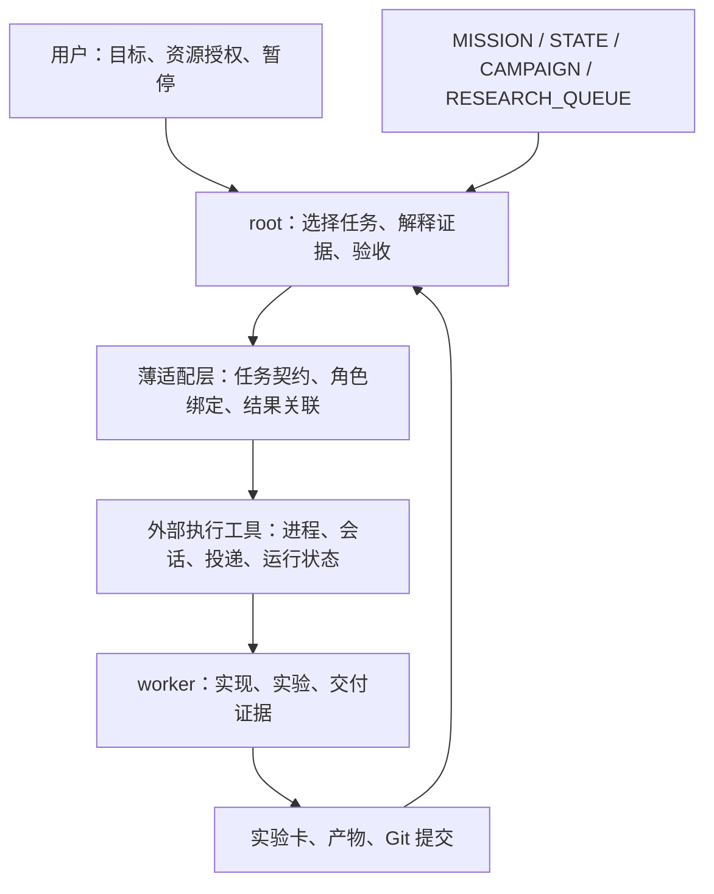

# 工作流精简草案

状态：用户已确认并要求直接实施；分支内实现与工程验证，不切换活跃系统。日期：2026-09-30。
分支：`agent/workflow-runtime-adoption`。

用户要求参照 [`ref.md`](../ref.md) 重新设计，不以现有 AGENTS.md 作为设计约束。
本草案将已有工作流当作待迁移实现，保留研究目标、证据和资源边界。

## 已查明的问题

六个控制脚本合计 3,208 行：agent_broker、root_watchdog、worker_event_poller、
agent_result_poller、codex_research_supervisor 和 researchctl。这只是脚本规模，
不是重复代码量；是否删除必须按职责和实际调用核对。

`scripts/agent_broker.py` 的 ProviderAdapter 构造请求，dispatch 将请求写入 SQLite。
它本身不启动 provider。当前审计尚未找到消费 TASK_DISPATCH 并完成运行时投递的实现。
所以排队成功不能被展示成 worker 已开始执行。

`scripts/root_watchdog.py` 与 `scripts/worker_event_poller.py` 依赖 Codex 内部 Goal、
rollout 和本机绑定；agent_result_poller 还承载运行时读取与恢复功能。
这些路径把科研监督和 provider 实现细节耦合在一起。

工作流规范分散于 AGENT_BROKER、AGENT_COORDINATION、ROOT_AGENT、AGENT_POLLER、
CODEX_RESEARCH_SUPERVISOR 等入口。目标应是减少独立规则与状态来源，而不是再增加
一套长期并存的规范。

## 建议的职责边界（待讨论确认）

研究任务包含要区分的假设、影响的决策、最便宜方法、预算、停止条件和交付物。
运行任务的完成只说明执行结束；科研结论与 main 集成仍需 root 验收。

仓库保留研究队列和实验记录。执行状态由后端拥有；适配层只保存研究任务到后端
任务/会话的关联，不再复制一套完整 task state machine。

保留模型会话不等于保证监督持续运行。root 是否持续推进、退出后的恢复入口、用户
暂停如何阻止新派发，必须形成明确且可测试的合同。

## 外部实现核对

优先候选为 [backnotprop/orchestrator](https://github.com/backnotprop/orchestrator)。
其 [operator guide](https://github.com/backnotprop/orchestrator/blob/main/doc/operator-guide.md)
提供任务状态、结果、续接和中断接口；它适合作为执行层候选，尚未通过本仓库验收。

[Codex session 文档](https://github.com/backnotprop/orchestrator/blob/main/doc/codex-app-server.md)
描述持久线程、send、Goal 与共享 app-server backend。这不自动证明多个 CODEX_HOME、
provider 或账号能彼此隔离，也不自动解决 root 的持续监督。

[zetbrush/multiagents](https://github.com/zetbrush/multiagents) 的 Broker、消息与团队管理
可作备选。但其 peer communication / team manager 模型是否符合所选角色权限，需要
额外核对。暂不同时接入两个后端。

以上核对日期为 2026-09-30；正式实现需固定上游版本并查看代码，不能仅依赖 README。

## 切换前必须通过的场景

1. 实际投递一个有界工程任务，观察启动、结果、退出和归属，不能只验证排队。
2. 两个独立账号/provider 配置无串用；续接保持正确身份，失败不会默默换账号。
3. 执行控制进程重启后可定位已有任务，避免重复派发、重复消费结果。
4. 用户暂停后没有新派发，已启动实验继续收尾；恢复后再推进下一项任务。
5. worker 完成时 root 可接收结果；root 会话不可用时有明确、有限的恢复路径。
6. 单个会话故障或中断不影响其他会话；长训练进程的停止与证据归属可核验。
7. 新后端关闭后能回到旧入口；旧研究证据、checkpoint 和用户改动完整保留。

这些场景优先用本地假运行时或 shell 工程任务验证；真实模型账号验证单独控制成本。

## 迁移顺序

先确认精简范围、角色模型和监督模式，再确定账号隔离、暂停、交付与恢复合同。
基于合同审计上游源码，选择一个后端，编写最小适配路径并验证上述场景。
验证通过后统一工作流入口、替换调用，再删除无调用的旧控制实现和重复规则。
不复制旧 SQLite 为新后端的事实来源；活动任务迁移策略须在切换前明确。

## 当前设计树

第一轮已由用户确认：

- 文档与运行代码一起精简。
- 固定逻辑角色，会话与 provider 可替换。见 [ADR 0001](../adr/0001-separate-role-from-session.md)。
- 预算内持续推进，并支持可靠暂停。

第二轮已确认：

- 必须支持多个独立账号/provider，包括各角色的独立配置与会话隔离。
- 关闭前台 root 对话后，后台仍需自主验收并继续派发，受预算和暂停约束。
- 暂停停止新派发，允许已启动实验收尾。它不等于中断或杀死实验进程。

第三轮已由用户确认：

- 后台研究主管保留 Codex root。
- 意外退出允许有限自动恢复，不因重启重复启动已有实验；明确暂停优先于恢复推进。
- 旧任务在旧系统收尾，新系统接新任务；不要求迁移运行中的会话。

用户随后要求 to-spec 完成后直接 implement，整体设计方向已确认。活跃系统切换仍需真实账号验收。

关闭前台对话后的持续推进是明确验收要求：仅保留 worker 进程或一个 idle session
不足以通过。应验证后台主管能收到完成事件、验收交付并选择下一项任务，同时前台
重连不会产生第二个同时派发的主管。

## 补充审计

- watchdog 与 worker poller 都导入 agent_result_poller；撤旧前必须迁出仍需保留的
  artifact/GPU observation helper。
- 角色在 roles 配置和 registry 的 pool.roles 中重复；registry、binding、lease
  又都参与当前身份判定。拟收敛为一份角色定义和一份本机绑定。
- Broker.observe 固定写 OBSERVED/current_task=None；其 runtime_state 可能与任务表
  中的 RUNNING 不一致。新架构应避免再次建立执行状态镜像。
- 监督意图、模型会话存活、训练作业运行应分别判断；一次会话退出不能被视为实验结束。

## 上游源码审计：不能直接整体替换

2026-09-30 静态审计发现 Orchestrator 两个明确缺口；未做真实账号验证：

- [backend 路径计算](https://github.com/backnotprop/orchestrator/blob/main/packages/core/src/tasks/executors/protocol/codex-app-server-controller.ts#L256)
  只使用 orchestratorDir；健康 backend 被直接复用，首次启动才合并环境。
  同一 store 下不同 CODEX_HOME 不具有独立 backend。需按账号隔离 store/backend，
  或修改上游隔离键，且必须验证真实身份，而非仅看 thread ID 不同。
- [后台任务启动](https://github.com/backnotprop/orchestrator/blob/main/packages/cli/src/background-task.ts#L51)
  使用 detached 进程，可以脱离前台。但
  [parent session](https://github.com/backnotprop/orchestrator/blob/main/packages/agent/src/session.ts#L48)
  基于 Pi，不能直接接续现有 Codex root。
- [run 命令](https://github.com/backnotprop/orchestrator/blob/main/packages/cli/src/commands/run.ts#L287)
  执行一次 prompt 后 dispose session；
  [后台 parent ADR](https://github.com/backnotprop/orchestrator/blob/main/adr/decisions/0024-run-parent-agent-as-managed-background-task-20260618-193203.md#L69)
  明确未包含 automatic parent continuation。

候选方案应收敛为：采用外部执行层，仓库保留小型后台研究监督入口。
执行层管理进程与会话，研究监督入口维护推进/暂停意图、关联结果、调用主管做判断。
它不重新实现 provider 协议，也不把任务执行成功自动升级为科研结论。

## 已确认的整体方案

1. 研究层保留 MISSION、STATE、CAMPAIGN、RESEARCH_QUEUE、实验卡与证据验收。
   root 使用 Codex，职责是研究判断、选择任务和集成；角色、会话与实验身份分开。
2. 执行层优先验证 Orchestrator；按账号/provider 使用独立 store/backend，避免共享
   backend 串用身份。适配层只关联研究任务与执行 ID，不另造完整执行状态机。
3. 后台监督入口独立于前台对话，串行驱动一个 Codex root 做任务选择与验收。
   前台是查询、讨论和控制入口，不另起第二个派发主管。实验结果、主管退出和用户
   控制分别处理；不要求某个原生 Goal 永久 active。
4. 暂停阻止新派发，保留现有实验与结果记录。意外退出有限恢复，先核对任务归属
   和交付状态再推进；连续失败后停止自动恢复并报告。恢复次数与退避参数在实现时
   设为明确、可配置的有限值，不将未知执行结果视为可安全重试。
5. 文档目标为一份工作流规范、一份操作指南和一份固定角色定义；本机账号绑定、
   监督控制与后端运行状态不提交。撤掉已替换且无调用的 Broker、Goal 恢复和内部
   rollout/数据库读取路径，必要的实验产物与进程观测独立保留。
6. 在分支先验证账号隔离、真实投递、前台关闭后的连续任务、可靠暂停、故障恢复
   和唯一派发者，再改默认入口。切换只影响新任务，旧实验收尾；研究证据与用户
   改动完整保留。如果候选后端不能满足门槛，先报告具体缺口，再决定替代方案。

讨论节奏：用户没有回答期限；每轮问题保持待答，不以工具返回或经过一段时间代替
回答。整体方案已由用户直接实施的指令确认，当前进行分支内实现和验收。
