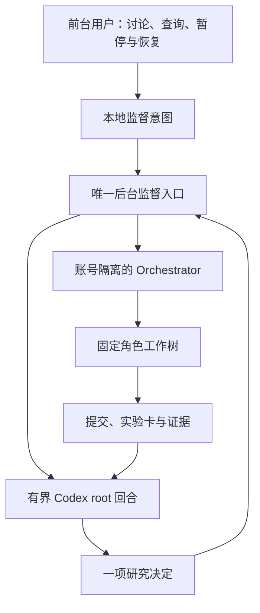

# Ref2Dex 工作流架构

研究主管使用 Codex，固定逻辑角色为 root、agent_cm、agent_rl、agent_eval、agent_infra。
逻辑角色与会话分离：角色代表职责与权限，会话和 provider 可以更换。资源权限仅由
[角色定义](../AGENT_ROLES.yaml)、[CAMPAIGN](../CAMPAIGN.md)和用户授权决定。

## 研究层与执行层

root 读取 MISSION、STATE、CAMPAIGN 和 RESEARCH_QUEUE，选择能够改变研究决策的任务，
验收证据并集成已验证的提交。执行成功不等于证据已接受；Probe 与 Validation 的
结论边界不变。worker 在自己的工作树执行任务，报告提交、输入、指标、产物和进程
终态；跨角色需求退回 root，不自行派发。

外部 Orchestrator 管理 task、进程、日志与运行状态；Ref2Dex 只保存推进/暂停意图、
研究任务到执行 ID 的关联及证据验收。新路径不读取 Codex 内部 Goal、queue 或 rollout
数据库，不维持原生 Goal 永久 active，不复制完整的执行状态机。

后台监督入口脱离前台进程运行。每次 root 输出一项 JSON 决定：dispatch、accept、
reject 或 idle。确定性入口验证任务、权限、预算和验收状态后应用决定。root 不绕过
入口直接派发；worker 不写控制状态。前台重连不会产生第二个派发主管。

## 身份与绑定

一份 tracked 角色定义、一份本机 workflow 配置。每个角色有独立 store、workspace、
runtime、provider 标识；Codex 还必须指定 CODEX_HOME。store 使用绑定、非秘密账号身份和有效配置来源的指纹封存；正常 OAuth token 刷新不改变账号身份。
更换账号、环境或 provider 要使用新 store。未知或不匹配的身份不自动接管。
当前默认使用有界 process task；会话连续性不是身份持久性的前提。

环境中的常见模型凭据从调用环境移除，显式本机 binding.env 才可注入。不同 provider
也使用各自 runtime 配置；不能通过仅改 provider 显示名称来选择真实模型服务。
配置、凭据和执行数据库不提交，历史 registry 不参与新路径判定。

## 暂停、预算与恢复

Pause 停止新派发，已启动实验继续收尾。后台仍可观察已有结果，恢复后再调用主管
推进。后台 owner 停止时可手动验收已完成交付；它不会派发新任务。后台运行时验收由同一 owner 负责。
暂停不等于 interrupt，不杀训练进程，不自动恢复用户明确的暂停。

任务需要 engineering/probe/validation 类型、objective、decision_test、GPU 数、有限 timeout、stop_conditions 和
deliverables。Campaign 必须有总派发数、root 回合数、wall time 和最多四张 GPU 的
明确限额和授权工作树根目录。禁止实验的角色只接 engineering 任务。恢复不会重置已花费的派发/时间预算；超限停止新执行，已有实验可收尾。
GPU 数由角色权限和当前未验收任务的实际后端状态联合约束。停用的旧任务资源要
纳入启动新 campaign 前的可用预算；不得抢占未知进程。

唯一 owner 由本地进程锁保证。派发前持久化唯一意图，投递后保存执行 ID。投递响应
丢失时按唯一任务名找回；找不到或找到多个执行时进入 attention，禁止盲目重投。
后端状态不可用时不能推断完成。有限重试采用退避，连续失败后停止并报告。
后台 guardian 仅管理自己启动的监督子进程；用户暂停时不重启推进。

idle 等待真实交付变化、研究入口内容变化或用户 resume，不重复调用模型发心跳。
证据验收需要明确 reason；失败任务可拒绝但不能接受，同一角色前一交付未处理前
不派新任务。交付验收不是科学结论自动升级。

## 迁移边界

旧任务由旧系统收尾，新系统只接新任务。启用新派发前必须关闭旧派发/恢复 owner，
再显式确认唯一控制权。代码提供切换 guard；跨旧系统控制权的事实仍须部署时核验。
旧 Broker/poller/watchdog 与兼容命令暂保留供收尾；退出默认上下文和新运行路径，
旧任务结束且无依赖后再删除。此分支不修改活跃 binding、停止旧进程或迁移旧 SQLite。

当前验证包含公共命令行为与真实 Orchestrator 工程进程。真实账号隔离、Codex root
回合和实际机器上的旧 owner 停用仍是上线门槛；工程 smoke 不能替代它们。
