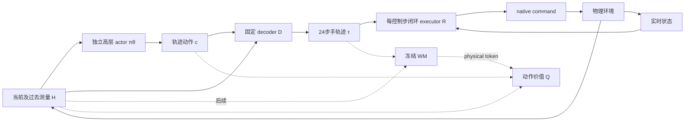

# ref1：独立 trajectory policy 的架构建议

日期：2026-10-10。输入：[用户ref1](../user/ref/ref1.md)。性质：设计判断，未运行新Task
训练/仿真。根级[Mission](../../../../../docs/MISSION.md)的自训练操纵与Cm策略训练收益
目标不变；用户要求暂停consequence-evaluator后续实验，在本Task探索新架构。

后续首轮原型已完成：[48D覆盖Probe](../experiments/probes/P-20261010-trajectory-decoder-coverage.md)。
密集几何τ4/4长时终末held，而四节点重建两组均0/4终末持有；审计未见接线错误。
这使下面“结构化48维先起步”的建议停在D/R修复阶段，尚不能直接进入PPO。
节点复制不是所有latent c的控制性能上界；下一步先区分拟合问题与D表达能力，
保留独立actor结构，不升级为trajectory policy无效或WM无用的结论。

进一步诊断：固定直线段的最优XYZ/FF前缀RMS最差32/31mm，说明仅调整节点复制
难以复现该轨迹。改试48维PCA时间基底后first8手点RMS从13.97降到5.61mm，
仍因启动掌部23.62mm/FF18.50mm未过几何screen，未进入仿真。
因此优先保留独立actor与低维learned D思路，让拟合目标对齐前缀实际几何/速度；
不把低全局重建loss作为可以开始PPO或已学会操纵的证据。

## 我选择的主版本

采用ref1后半部分：`c~πθ(c|H)`直接提出运动，`τ=D(H,c)`交给闭环executor R。
不把`c_ref+Δc`作为最终结构。旧策略只用于数据、初始化、训练早期行为先验。
第一版先不带WM、evaluator、Y或在线planner，训练无WM的trajectory PPO baseline。

actor先产生c，WM再编码这条计划，Q评价其回报；部署actor无须同时输入它自己尚未
产生动作的token，避免循环定义。c是动作；z_phys是动作条件后果特征，身份分开。

## 从现有证据带走什么

- 纯H位移MLP仅有离线正Probe：212.66mm优于persistence262.14mm。完整生成执行
  无抓持，不能当已可用的初始化控制策略。GTτ→A长时4/4也不保证任意τ可执行。
- 最新修复35093fb：在线geometry q0是实测state，不能混入nominal未来速度。
  用未来q单独差分后，GT在线接口128步4/4held45并终末held；原接口终末0/4。
  修复后的纯H full542step r3仍三个生成角色0/4，GT4/4、median479。
  因此新Task接R时必须包含该修复，不能沿用原速度语义或说executor已普遍训练好。
- 启动数据纯文件检查：96条train episode的padded tick0 H与部署tick0 H逐值一致；
  已有前24步手轨迹中，最接近GT参考的point-3D RMS约1.37mm。旧collect从tick8
  开始，跳过了这些监督。它提示初始化数据可补启动窗口，尚不是训练/执行成功证据。
- 保留旧Task源代码与产物身份，按需复用稳定模块；新模型/训练入口放本Task，
  不复制旧evaluator长链路，也不修改用户ref目录。

启动纯文件审计（含input SHA）：`outputs/trajectory-policy/ref1-startup-input-audit-20261010-r1/audit.json`。
证据：[原生执行卡](../../../consequence-evaluator/docs/experiments/probes/P-20261010-generated-tau-native-execution.md)、
[接口诊断卡](../../../consequence-evaluator/docs/experiments/probes/P-20261010-generated-tau-interface-diagnosis.md)。

## 轨迹动作空间：先让c的控制意义可检查

| 起步方式 | 优点 | 关键风险 | 当前判断 |
| --- | --- | --- | --- |
| 直接792维τ | 能直接迁移原predictor | 探索维数大，手点可非刚性，仍需约束投影 | 作为表达参考，不作为首个PPO实现 |
| learned16--64维decoder | 可学习非线性动作流形 | 新的coverage/latent优化瓶颈，重建好不代表接触可控 | 后续有明确表达缺口才试 |
| 结构化48维轨迹参数 | 可解释、无需先训练复杂decoder、可直接检查可达性 | 样条节点和几何姿态同样可能限制动态/preload | 首个可证伪原型建议 |

结构化c的具体起点：四个时间节点，每节点腕6自由度+六个独立手指形状参数，合计48维。
腕在query object frame表达，平移与SO(3)旋转插值；手指遵守本手URDF的bounds/coupling。
D从当前测量姿态展开24帧，并通过FK输出11点τ。第一版固定节点/插值和限幅，不做
维数/节点搜索。节点位置及第一步速度连续性须在初始化轨迹上审计后冻结，不能
只看全手平均RMSE；单独检查掌部姿态、拇指/指尖、接触阶段误差和执行后的握持。

这是绝对latent actor：每次采样的c独立决定计划，不加冻结base动作。以当前姿态为
坐标原点仍是测量锚定，不是母策略依赖。bounds、平滑和固定D的image依然限制动作
集合；λ_prior→0不能保证超越这一限制。

如果D能同时给出其自身FK几何q，可作为R的派生量，避免重复在线求逆；q来自c/当前
状态和URDF，绝不是真实未来q_ref。τ接口仍保留并用于物理模型，R的native命令与
finger preload仍由实时反馈控制。这个选择须验证与原τ投影入口的行为一致性，
不能把c直接当PD命令而跳过executor，或用低重建误差代替动力学验证。

重要边界：如果这个动作空间不能复现已有可执行τ的关键接触微调，先修D/R或增加
必要表达自由度，不继续堆WM。原型通过只说明这套D/R值得进入RL，不证明trajectory
接口一定优于native-action policy。

## 第一阶段训练：明确高层PPO的时间与数据合同

H继承当前/过去手物测量：先用四帧，包含手几何、物体SE3、手指q/dq和物体速度；
旧300维只是一个已有编码，不是新Task的固定规格。其query-object坐标化丢弃当前
绝对物体高度与世界重力在物体坐标中的方向；新task应保留/核对这些纯当前测量量
（例如物体相对固定桌面的高度、query frame中的重力方向），让抬升reward与物理
条件可辨识，再冻结输入合同。不能把纯H误解为删去任务相关当前状态。部署不含未来参考、phase/clock、旧actor obs、tactile/force或训练标签。
bootstrap重复最早实测state。更长历史/递归网络留到存在恢复失败或别名证据时。
不把native GPU row分岔直接等同于H必然不足；观测别名和solver噪声需区分。

初始数据用已有完整测量轨迹，包含tick0--7 padded history和普通滑动窗口，未来手τ
仅作离线标签。训练H→c或H→D(H,c)的监督初始化，按episode隔离划分；原predictor
可作对照/初始化线索，不默认其输出可执行。pβ(c|H)只用train数据拟合，在训练早期
提供KL正则。λ先固定、出现真实性能信号后再按预声明规则衰减；不把关掉KL等同于
已突破数据support。无论是否显式prior，都需报告初始化与额外数据成本。

一次高层action是c：πθ输出mean/std，存采样c、旧logprob和H。D/R在第一轮PPO
固定，R每个control step读取live state、输出native action。高层默认24步计划、
执行8步后重规划。原R还需要24帧lookahead，chunk内shift/padding的语义须和训练
一致；不能因为几何可达就忽略此分布变化。

高层transition为`(H_t,c_t,R_k,H_(t+k),k,done)`，其中
`R_k=Σ(j=0..k-1)γ^j r_(t+j)`，bootstrap是`γ^k V(H_(t+k))`，提前done按实际k且
终止项为0。只在高层采样时记录一次logprob，不重复到八个native steps。GAE的时间
单位同时冻结，不沿用原32低层步代码而遗漏高层折扣。PPO使用V(H)；环境、D/R不
需要可微。普通状态baseline不输入本次采样c生成的z_phys。

reward使用真实物体抬升/持续held/失持及适度控制正则；评价包括保持时长、终末持有
和裁剪，不读未来object/q参考。DExplore原生reward含hoi_ref物体/关节跟踪，不能
因为它叫Gym reward便直接沿用。先沿用已核对的几何held评价；tactile不进policy。
训练初始化reset与完整从tick0评价分开，不用参考中间帧reset掩盖首次抓持失败。

## 第二阶段：WM接动作critic，而不是把所有token都拼给actor

目标是`z_phys=F_WM(H,τ)`辅助`Q(H,c,z_phys)`的真实task-return学习。不是必须解码
未来E/I给actor；E/I或几何预测可训练表征，但其loss低不等于控制增益。

先冻结现有PointWorld权重，核对输入adapter、时间token和归一化。当前PW temporal
接口接24×2×11×9 action features，并输出物体运动，没有直接输出所需physical token。
单手3维τ要按原合同构造其余特征/有效mask；不能用未来物体标签补缺失通道。选择
backbone的pre-head表示并做小projector属于新增接口，须核对动作敏感性及来源。
目前human/recorded实际手轨迹监督与新策略的期望τ经R执行是不同的动力学条件；
初始化迁移不是已经可靠的“任意候选后果预测”。适配需保留期望τ与实际执行轨迹。

WM前缀监督先针对这次实际执行的8步真实hand/object变化，条件可以读完整τ，因为
R的前缀也读后续lookahead。不能把执行8步后重新采样策略的actual24步结果标成
“固定这条τ执行24步”的后果。后者若作辅助预测，必须明确延续策略假设。

第一版PPO的V(H)与后续action-Q路线区分。如果采用TD3/SAC，通过Q(H,c,z)改actor，
冻结WM参数仍可能保留对c的梯度，stop-grad会改变梯度路径，须明确配置及对照。
如果继续PPO，要明确动作Q如何参与advantage/辅助训练，不直接替换普通V(H)；
这不是换个critic输入即可。当前不同时实现PPO、SAC、TD3和planner。

**RLT类比需修正。** 原文token压缩当前VLA观测表征，actor另接reference chunk并
输出完整动作chunk，不是候选τ的physical token或强制永久residual。这里只借鉴
冻结大模型+小RL头，不能借其成功结果证明本路线。[来源核对](20261010-trajectory-policy-source-check.md)

## 最小推进顺序与停止条件

1. 固定一个D/R合同，离线检查可执行τ覆盖，再用少量原生完整episode验证初始化
   从tick0抓持/保持；这一步无WM，也不立刻训练四套新架构。
2. 固定D/R训练一个trajectory PPO Probe，报告真实策略性能与资源成本。先判断
   高层c是否产生有意义的行为改变，再与相同输入/reward/初始化来源、按相同低层
   环境交互预算计费的native PPO比较。两者控制频率与额外预训练成本单列，不把
   “高层transition少八倍”说成样本效率好八倍。
3. baseline有可用信号后，固定动作接口与RL算法，做Cm-on/off matched策略训练。
   第一条scientific必要对照是无token；shuffled、冻结同容量非物理特征是按具体
   归因问题追加的Probe，不一开始做全套sweep。记录WM额外数据/compute/latency。
   token仅改善离线return拟合不足以完成Mission。

D/R覆盖不过则停在该blocker；PPO无行为进展先查实际高层采样/执行/reward路径；
不以网络加深、加prior或加WM替代解释。Cm无增益时不得自动升级为“WM无必要”的
正式结论或放弃核心Mission；遵循Decision Checkpoint，以Probe标签和清楚的适用
范围记录有效负结果，必要时再做matched Validation或请用户改变全局claim。

以上是最初设计建议；后续执行证据以Task实验卡为准，尚未完成高层策略baseline。

## 2026-10-10 动作接口试验后的修订

四节点48D、最佳前缀拟合、coordinate-PCA和pose/FF metric的证据见Task实验卡。
最终metric离线误差很小，在线live-state重编码仍出现明显投影误差，两组长时
保持2/4与0/4，而密集几何轨迹4/4。链路审计通过，只能局部评价当前固定D/R组合；
没有证据证明所有48D策略都不可行。按预声明停止继续重建搜索。

第一轮学习改用直接24x12=288维物理轨迹坐标：query-object frame下相对当前腕部
XYZ与SO3，以及六个独立手指角；每步全部保留。绝对actor输出c，D只做坐标恢复、
native bounds/coupling和FK，没有在线reference chunk或母策略。这里“绝对actor”
指不依赖reference-action基座，不要求坐标必须在世界系中表达。真实未来q/object
仍不能作为actor/executor输入，encode仅接受离线手轨迹反解的几何标签。

先检查D288与已保存dense成功执行计划的literal native Euler、FK、future-only
velocity/FF一致。这只是接口工程核对；下一次有学习意义的Probe应针对纯H actor
初始化及执行，不能把又一个oracle重放当作H→τ已经学会。先固定D/R与无WM baseline，
减少同时变化的模块。288维探索方差、实际接触执行及episode外泛化仍需评估；
当前单motion行划分不能替代独立motion泛化证据。
